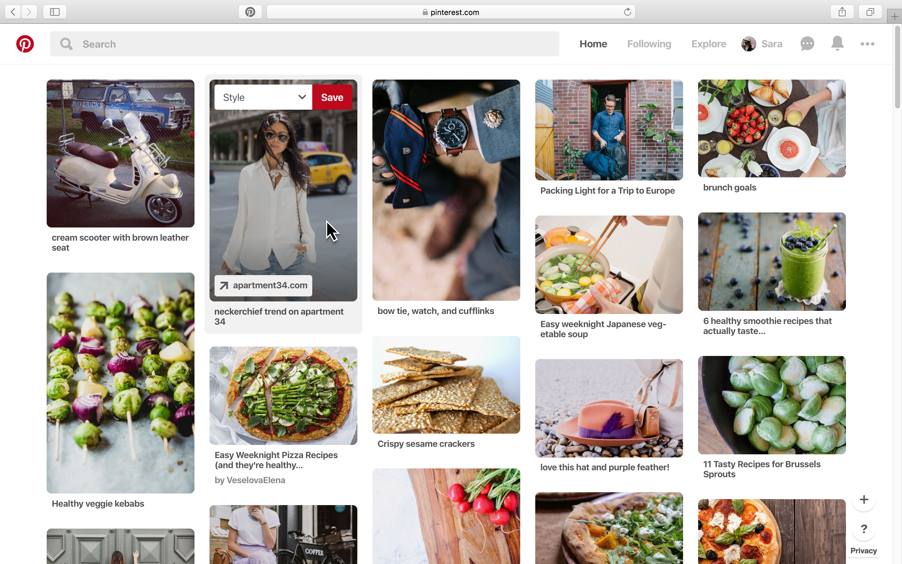
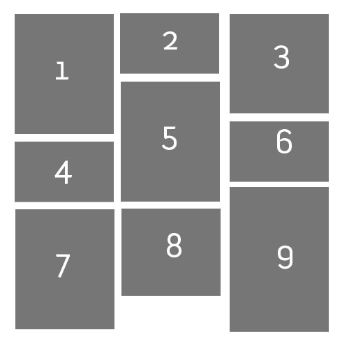

# Projet d'intégration Laravel : ImageShare

- Durée: 1 semaine
- SOLO
- Repository Github: `ImageShare`
- Déployer son application

## Prérequis:

- Connaître la **POO PHP**
- Avoir suivi le briefing sur **Laravel**
- Savoir utiliser un framework Frontend (Bootstrap ou autres)
- Utiliser **Git/Github**

## Objectifs:

L'object de ce projet est de reproduire "non à l'identique" la plateforme **Pinterest**. Son but ici est d'approfondir les connaissances du framework Laravel.

### Conditions:

- Une page d'accueil qui reprend tous les partages des utilisateurs, tu dois afficher les images sous forme de tuiles.

- Au clique de ces images, on est redirigé vers une page qui apporte plus de détails à celle-ci en affichant:
  
  - L'image (redirige vers un lien externe au clique)
  - Son titre
  - Sa déscription
  - L'auteur du partage (redirection vers son profil au clique)

- Une page Login et Register, soit un utilisateur doit être caractérisé par:
  
  - Un nom
  - un prénom
  - un pseudo
  - une image de profil
  - une adresse email
  - un mot de passe

- Une page profil:
  - Afficher les informations de l'utilisateur
  - Afficher tous les partages de l'utilisateur
  

- Une page pour ajouter un nouveau partage

Ps: CRUD ;)

## Ce que tu vas apprendre:

- Authentification
- Gestion des images 
- Relations de tables (1:n => one to many)

## Aller plus loin

Déjà terminé? Voici deux fonctionnalités que tu pourrais mettre en place.

### LIKE
- Homepage: 
  - Chaque image a un un bouton **LIKE**
- Profil:
  - Toutes les images **LIKÉES** doivent apparaitrent sur la page profil de l'utilisateur connecté

### Abonnement / Abonné

- Intégré la fonctionnalité Abonnement / Abonné (si elle seulement si l'utilisateur est authentifié).

## Ressources
- [Laravel Eloquent relationships](https://laravel.com/docs/8.x/eloquent-relationships)
- [Tiles](https://mastery.games/post/tile-layouts/)
- [Tiles 2](https://www.solodev.com/blog/web-design/displaying-content-with-responsive-tiles.stml)
- [Storage files](https://laravel.com/docs/8.x/filesystem#storing-files)

